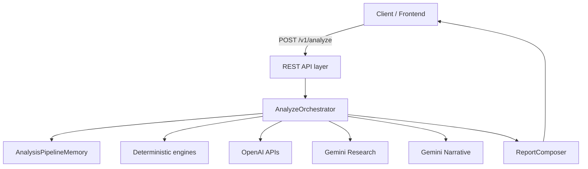
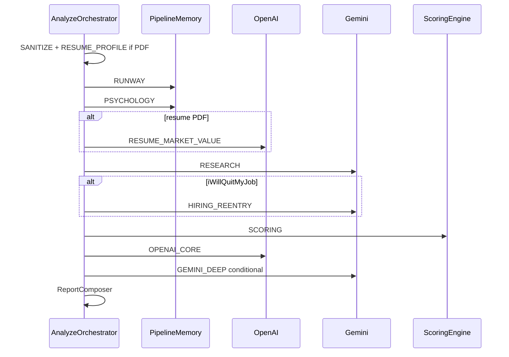
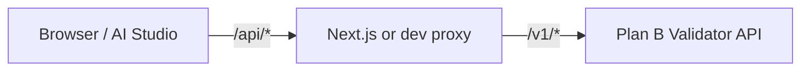

# Plan B Validator — Complete Service Documentation

**Single source of truth** for the Plan B Validator backend. Consolidated May 2026; prior fragmented docs under `docs/` were merged into this file.

---

## Table of contents

1. [Overview and principles](#1-overview-and-principles)
2. [Quick start and deployment](#2-quick-start-and-deployment)
3. [REST API reference](#3-rest-api-reference)
4. [Analyze pipeline](#4-analyze-pipeline)
5. [Scoring, runway, and configuration](#5-scoring-runway-and-configuration)
6. [External providers](#6-external-providers)
7. [Operations: logging, debugging, curl](#7-operations-logging-debugging-curl)
8. [Frontend integration](#8-frontend-integration)
9. [Codebase map and testing](#9-codebase-map-and-testing)

---

## 1. Overview and principles

### What the service does

**Plan B Validator** is a stateless Spring Boot API that evaluates a risky career or life pivot (“Plan B”). It accepts structured user input (profile, finances, Plan B plan, constraints, psychology questionnaire), optionally a **resume PDF**, and returns a single JSON report with:

- A deterministic **verdict** and **feasibility / risk scores**
- Financial **runway** analysis
- Web-backed **market research** and (when quitting) **corporate re-hire outlook**
- LLM-generated **narratives** that explain the verdict without overriding it

### Product stance

| Rule | Detail |
|------|--------|
| **Scores and verdict are authoritative** | Computed in Java (`ScoringEngine`) |
| **LLMs explain only** | OpenAI core narrative + optional Gemini deep narrative; template fallbacks if providers fail |
| **Decision support** | Not financial, legal, or psychological advice (see `planb.disclaimer` in config) |

### AI provider roles

| Provider | Responsibilities |
|----------|------------------|
| **Gemini** | Google Search–grounded market research; corporate re-hire assessment when user quits job; deep explanatory narrative |
| **OpenAI** | Resume profile extraction from PDF; resume market-value signals; core recommendation narrative |

There is **no Perplexity** integration in this codebase.

### High-level architecture



| Layer | Key classes |
|-------|-------------|
| API | `AnalyzeController`, filters, `GlobalExceptionHandler` |
| Orchestration | `AnalyzeOrchestrator` |
| Pipeline memory | `AnalysisPipelineMemory` — compact slices per LLM step |
| Deterministic | `SanitizationService`, `RunwayService`, `PsychologyEngine`, `ScoringEngine` |
| AI | `OpenAiResumeProfileParserService`, `OpenAiResumeMarketValueService`, `GeminiGroundedResearchService`, `HiringReentryResearchService`, `LlmReasoningService` |
| Response | `ReportComposer` |

---

## 2. Quick start and deployment

### Prerequisites

- **Java 21** (local run)
- **Docker** (optional, recommended)
- API keys: `OPENAI_API_KEY`, `GEMINI_API_KEY` (see [Environment variables](#environment-variables))

### Run with Docker

```bash
cp .env.example .env   # add API keys
docker compose up --build
```

API listens on **port 8080**. Tests are skipped in the Docker image build.

### Run locally (no Docker)

```bash
cp .env.example .env
./scripts/run-local.sh
```

Or manually:

```bash
set -a && source .env && set +a
./mvnw spring-boot:run -Dspring-boot.run.arguments=--server.port=8080
```

If port 8080 is in use: `docker compose down` first.

### Health checks

| Endpoint | Purpose |
|----------|---------|
| `GET /v1/health` | Custom health: `{ "status", "version" }` |
| Spring Actuator | `management.endpoints.web.exposure: health, info` |

```bash
curl -s http://localhost:8080/v1/health
```

### Environment variables

| Variable | Required | Default (via `application.yml`) | Purpose |
|----------|----------|----------------------------------|---------|
| `OPENAI_API_KEY` | For AI features | — | Resume parse, market value, core narrative |
| `OPENAI_MODEL` | No | `gpt-4.1` | OpenAI model |
| `GEMINI_API_KEY` | For research/narratives | — | Grounded research, hiring re-entry, deep narrative |
| `GEMINI_MODEL` | No | `gemini-2.5-pro` | Deep narrative model |
| `GEMINI_RESEARCH_MODEL` | No | `gemini-2.5-flash` | Research + hiring re-entry model |

Copy [`.env.example`](.env.example) to `.env` for Docker Compose (`env_file: .env`).

### CORS (development)

[`WebCorsConfig`](src/main/java/com/planbvalidator/config/WebCorsConfig.java) allows `/v1/**` from:

- `http://localhost:*`, `http://127.0.0.1:*`
- `https://*.ngrok-free.dev`, `https://*.ngrok.app`
- `https://*.web.app`, `https://*.firebaseapp.com`

Production frontends should use a **server-side proxy** and restrict origins.

### Multipart limits

From `application.yml`:

- Max file size: **10 MB** (resume PDF)
- Max request size: **12 MB**

---

## 3. REST API reference

### Conventions

| Topic | Rule |
|-------|------|
| Base URL | `http://localhost:8080` (or your deployment host) |
| JSON | **camelCase** field names |
| Request ID | `X-Request-Id` header optional; server generates UUID if absent; echoed in response and logs |
| Errors | `{ "error": { "code", "message", "requestId" } }` |

### Error codes

| HTTP | Code | When |
|------|------|------|
| 400 | `INVALID_INPUT` | Validation failure, bad multipart |
| 429 | `RATE_LIMITED` | Analyze rate limit exceeded |
| 500 | `INTERNAL_ERROR` | Unhandled server error |

### Rate limiting (analyze only)

Applies **only** to `POST /v1/analyze`:

| Limit | Default | Scope |
|-------|---------|-------|
| Per user | **1 request / 5 minutes** | `X-User-Id` header, else client IP (`X-Forwarded-For` first hop, else `remoteAddr`) |
| Global | **5 requests / minute** | All users combined |

Both limits must pass. On 429, response includes `Retry-After` (300s per-user, 60s global).

Configure in `application.yml` under `planb.rate-limit`.

Other endpoints (`/v1/health`, `/v1/runway/calculate`, questionnaire, etc.) are **not** rate-limited.

### Endpoint summary

| Method | Path | Request | Response |
|--------|------|---------|----------|
| `POST` | `/v1/analyze` | `AnalyzeRequest` JSON or multipart | `AnalyzeResponse` |
| `GET` | `/v1/health` | — | `HealthResponse` |
| `GET` | `/v1/metrics` | — | Stub `{ "status": "not_implemented" }` |
| `POST` | `/v1/runway/calculate` | `RunwayCalculateRequest` | `RunwayCalculateResponse` |
| `GET` | `/v1/questionnaire/questions` | — | `PsychologyQuestionsResponse` |
| `POST` | `/v1/questionnaire/score` | `QuestionnaireScoreRequest` | `QuestionnaireScoreResponse` |

**OpenAPI:** springdoc is on the classpath; UI typically at `/swagger-ui.html` when running.

---

### `POST /v1/analyze`

**Latency:** 30–90+ seconds with AI keys configured. **No SSE** — single JSON response. Client timeout: **240 seconds** recommended.

#### JSON-only

```http
POST /v1/analyze
Content-Type: application/json
```

Body: full `AnalyzeRequest` (see below). No resume → resume market-value step skipped.

#### Multipart (recommended with resume)

```http
POST /v1/analyze
Content-Type: multipart/form-data
```

| Part | Name | Type | Required |
|------|------|------|----------|
| JSON body | `request` | `application/json` | Yes |
| Resume | `resume` | PDF (`application/pdf`) | No |

Resume is **never** embedded in JSON — only as a PDF file part.

---

### `AnalyzeRequest` schema

| Section | Type | Required | Notes |
|---------|------|----------|-------|
| `profile` | `ProfileDto` | Yes | May be partial if resume PDF provided |
| `financials` | `FinancialsDto` | Yes | |
| `planB` | `PlanBDto` | Yes | Includes `iWillQuitMyJob` |
| `constraints` | `ConstraintsDto` | Yes | |
| `psychology` | `PsychologyDto` | Yes | 10 Likert fields, 1–5 each |
| `researchOptions` | `ResearchOptionsDto` | No | Default: research enabled |

#### `profile`

| Field | Type | Validation | Notes |
|-------|------|------------|-------|
| `currentProfession` | string | max 120 | Blank OK if resume will fill |
| `industry` | string | max 120 | |
| `yearsExperience` | number | ≥ 0 | |
| `country` | string | max 80 | Current location for comp research |
| `city` | string | max 80 | |

#### `financials`

| Field | Type | Validation | Notes |
|-------|------|------------|-------|
| `monthlyIncome` | number | ≥ 0 | Current salary |
| `liquidSavings` | number | ≥ 0 | Cash available for runway |
| `monthlyExpenses` | number | **> 0** | Living costs |
| `dependents` | integer | ≥ 0 | |
| `debtObligations` | number | ≥ 0 | **Monthly EMI**, not total debt |

#### `planB`

| Field | Type | Validation | Notes |
|-------|------|------------|-------|
| `title` | string | required, max 150 | |
| `description` | string | required, max 2000 | |
| `reason` | string | required, max 1000 | |
| `timelineMonths` | integer | 1–120 | |
| `expectedIncome3Months` | number | ≥ 0 | Plan B income at month 3 |
| `expectedIncome6Months` | number | ≥ 0 | |
| `expectedIncome12Months` | number | ≥ 0 | |
| `iWillQuitMyJob` | boolean | required | See [Quit job checkbox](#iwillquitmyjob) |
| `targetCountry` | string | optional, max 80 | Plan B market location |
| `targetCity` | string | optional, max 80 | |

#### `iWillQuitMyJob`

| Value | UI | Meaning | Derived `engagementMode` (response only) |
|-------|-----|---------|------------------------------------------|
| `false` | Unchecked | Keep job; Plan B as **side hustle** | `side_hustle` |
| `true` | Checked | **Quit** job for Plan B full-time | `full_time_leap` |

When `true`, pipeline runs **corporate re-hire research** (`currentMarketConditionForHiring`).

#### `constraints`

| Field | Type | Validation |
|-------|------|------------|
| `successDefinition` | string | required, max 1000 |
| `biggestFear` | string | required, max 1000 |
| `acceptableDownside` | string | required, max 1000 |
| `minimumAcceptableSalary` | number | ≥ 0, monthly |
| `acceptableMonthsWithoutIncome` | integer | 0–120 |
| `familyPressureLevel` | integer | 1–5 |

#### `psychology`

All fields required, integer **1–5** (Likert). Question text: `GET /v1/questionnaire/questions`.

| Field |
|-------|
| `uncertaintyTolerance`, `discipline`, `stressRecovery`, `validationDependency`, `impulsiveness`, `routineAdherence`, `setbackRecovery`, `uncertaintyStamina`, `financialResilience`, `selfDirectedMotivation` |

#### `researchOptions`

| Field | Type | Default |
|-------|------|---------|
| `enableResearch` | boolean | `true` if omitted |

When `false`, skips Gemini web research and hiring re-entry calls.

---

### Removed and derived fields (do not send)

| Field | Status |
|-------|--------|
| `engagementMode` | **Derived** on `planB` in responses only (`side_hustle` / `full_time_leap`) |
| `continueCurrentJob` | **Removed** |
| `canStartAsSideProject` | **Removed** |
| `reversible` | **Removed** — re-hire outlook from `currentMarketConditionForHiring` when quitting |
| `emergencyFundMonths`, `monthlySavings` | **Do not send** — derived in UI only |

---

### `AnalyzeResponse` schema

| Field | Type | Description |
|-------|------|-------------|
| `requestId` | string | Correlation ID |
| `processingMs` | long | Total wall time |
| `overallVerdict` | enum | `take_the_leap`, `take_with_caution`, `delay`, `do_not_take_now` |
| `feasibilityScore` | int | 0–100 |
| `riskScore` | int | 0–100 |
| `confidence` | enum | `low`, `medium`, `high` |
| `runwayMonths` | double | Scoring runway (side hustle: net burn; see scoring section) |
| `scoreBreakdown` | object | `financialRunway`, `marketFeasibility`, `riskTolerance`, `timelinePressure`, `reversibility` |
| `opportunityCost` | object | Deterministic opportunity-cost metric map |
| `psychologyAssessment` | object | PSYCHOLOGY pipeline output (same shape as `POST /v1/questionnaire/score`) |
| `recommendationSummary` | string | Core narrative |
| `majorReasons` | string[] | |
| `redFlags` | string[] | |
| `nextSteps` | string[] | |
| `assumptions` | string[] | |
| `dataGaps` | string[] | Transparency when data missing |
| `personalitySummary` | string | Deep narrative |
| `expectedFailureMode` | string | |
| `safestNextMove` | string | |
| `suggestedFallbackPlan` | string | |
| `planBRoiSummary` | string | From resume market value when available |
| `marketValueAssessment` | object | Resume-based assessment or null |
| `disclaimer` | string | Legal/product disclaimer |
| `timings` | map | Per-stage ms keys |
| `aiProviders` | map | Provider status per step |
| `researchContext` | object | Web research payload or absent |
| `currentMarketConditionForHiring` | object | Re-hire outlook when `iWillQuitMyJob: true` |
| `resolvedProfile` | object | Final profile after merge |
| `resolvedPlanB` | object | Final plan B (may include derived `engagementMode`) |
| `profileFieldSources` | map | `form` / `resume` per field |
| `resumeProfileExtraction` | object | Raw resume parse when PDF used |

#### `psychologyAssessment`

Always present on successful analyze (PSYCHOLOGY pipeline stage). Same JSON as `POST /v1/questionnaire/score`:

| Field | Type | Description |
|-------|------|-------------|
| `riskProfile` | string | `conservative`, `moderate_risk_taker`, or `aggressive_experimenter` |
| `scores` | map | Per-question normalized scores 0–100; keys are question ids (e.g. `uncertainty_tolerance`) |
| `summary` | string | Human-readable psychology summary |
| `riskTakingPotential` | int | 0–10 composite |
| `founderMindset` | int | 0–10 composite |

Feeds `scoreBreakdown.riskTolerance` and psychology-adjusted runway in scoring.

#### `currentMarketConditionForHiring` (when quitting)

Populated when `iWillQuitMyJob: true` and research succeeds:

| Field | Description |
|-------|-------------|
| `summary` | Narrative overview |
| `overall_reentry_score` | 0–100 |
| `overall_band` | e.g. favorable / moderate / challenging |
| `recommended_minimum_gap_months` | Suggested buffer before re-hire |
| `reentry_by_gap` | Array for 3, 6, 9, 12+ month gaps: `difficulty_score`, `difficulty_band`, `typical_weeks_to_offer_*`, `notes` |
| `salary_sources` | Web sources used |
| `market_notes` | Additional context |

Feeds **reversibility** sub-score (not a user checkbox).

---

### Results page field map (frontend)

| UI area | Response fields |
|---------|-----------------|
| Verdict hero | `overallVerdict`, `feasibilityScore`, `riskScore`, `confidence` |
| Runway card | `runwayMonths`, `scoreBreakdown.financialRunway` |
| Score breakdown | `scoreBreakdown` (all five sub-scores) |
| Psychology | `psychologyAssessment` — `riskProfile`, `scores`, `summary`, `riskTakingPotential`, `founderMindset` |
| Opportunity cost | `opportunityCost` |
| Recommendation | `recommendationSummary`, `majorReasons`, `redFlags`, `nextSteps` |
| Deep insight | `personalitySummary`, `expectedFailureMode`, `safestNextMove`, `suggestedFallbackPlan` |
| Re-hire card (quit only) | `currentMarketConditionForHiring` |
| Market / salary | `researchContext`, `marketValueAssessment`, `planBRoiSummary` |
| Profile transparency | `resolvedProfile`, `resolvedPlanB`, `profileFieldSources`, `resumeProfileExtraction` |
| Caveats | `assumptions`, `dataGaps`, `disclaimer` |
| Debug | `timings`, `aiProviders`, `requestId` |

---

### `POST /v1/runway/calculate`

Standalone runway (same logic as analyze runway step).

**Request:**

| Field | Type | Required | Notes |
|-------|------|----------|-------|
| `liquidSavings` | number | Yes | |
| `monthlyExpenses` | number | Yes | > 0 |
| `debtObligations` | number | No | Monthly EMI, default 0 |
| `monthlyIncome` | number | No | Default 0 |
| `sideHustle` | boolean | No | `true` → net burn subtracts income |

**Response:**

| Field | Description |
|-------|-------------|
| `runwayMonths` | Savings ÷ burn (capped at 999 for side hustle when income covers burn) |
| `monthlyBurn` | `monthlyExpenses + debtObligations` |
| `netBurn` | Side hustle: `max(0.01, monthlyBurn - monthlyIncome)` |
| `runwayMode` | `side_hustle_net_burn` or `emergency_full_burn` |
| `riskClassification` | `severe`, `high_risk`, `moderate`, `stable` |

For side hustle preview in UI: `sideHustle: true` when `iWillQuitMyJob === false`.

---

### Questionnaire endpoints

**`GET /v1/questionnaire/questions`** — Returns `scale` (Likert labels) and `questions[]` with `id`, `field`, `question`, `invertScoring`, min/max rating.

**`POST /v1/questionnaire/score`** — Body: `{ "psychology": { ...10 fields } }`. Response: `riskProfile`, `scores`, `summary`, `riskTakingPotential` (0–10), `founderMindset` (0–10).

---

### Minimal analyze example (JSON)

See [`scripts/e2e-analyze.json`](../scripts/e2e-analyze.json) for a full side-hustle payload.

```json
{
  "profile": { "currentProfession": "Backend Engineer", "industry": "Fintech", "yearsExperience": 4, "country": "India", "city": "Bengaluru" },
  "financials": { "monthlyIncome": 180000, "liquidSavings": 900000, "monthlyExpenses": 65000, "dependents": 0, "debtObligations": 0 },
  "planB": {
    "title": "AI Freelance Consulting",
    "description": "Evening AI consulting",
    "reason": "Independent income",
    "timelineMonths": 9,
    "iWillQuitMyJob": false,
    "expectedIncome3Months": 15000,
    "expectedIncome6Months": 55000,
    "expectedIncome12Months": 120000
  },
  "constraints": {
    "successDefinition": "3 paying clients",
    "biggestFear": "Burnout",
    "acceptableDownside": "Pause if needed",
    "minimumAcceptableSalary": 100000,
    "acceptableMonthsWithoutIncome": 4,
    "familyPressureLevel": 2
  },
  "psychology": {
    "uncertaintyTolerance": 4, "discipline": 4, "stressRecovery": 3,
    "validationDependency": 2, "impulsiveness": 2, "routineAdherence": 4,
    "setbackRecovery": 4, "uncertaintyStamina": 4, "financialResilience": 4,
    "selfDirectedMotivation": 5
  },
  "researchOptions": { "enableResearch": true }
}
```

---

### TypeScript appendix (API contract)

```typescript
type Verdict = 'take_the_leap' | 'take_with_caution' | 'delay' | 'do_not_take_now';
type ConfidenceLevel = 'low' | 'medium' | 'high';

interface AnalyzeRequest {
  profile: {
    currentProfession?: string;
    industry?: string;
    yearsExperience?: number;
    country?: string;
    city?: string;
  };
  financials: {
    monthlyIncome: number;
    liquidSavings: number;
    monthlyExpenses: number;
    dependents: number;
    debtObligations: number;
  };
  planB: {
    title: string;
    description: string;
    reason: string;
    timelineMonths: number;
    expectedIncome3Months: number;
    expectedIncome6Months: number;
    expectedIncome12Months: number;
    iWillQuitMyJob: boolean;
    targetCountry?: string;
    targetCity?: string;
  };
  constraints: {
    successDefinition: string;
    biggestFear: string;
    acceptableDownside: string;
    minimumAcceptableSalary: number;
    acceptableMonthsWithoutIncome: number;
    familyPressureLevel: number;
  };
  psychology: {
    uncertaintyTolerance: number;
    discipline: number;
    stressRecovery: number;
    validationDependency: number;
    impulsiveness: number;
    routineAdherence: number;
    setbackRecovery: number;
    uncertaintyStamina: number;
    financialResilience: number;
    selfDirectedMotivation: number;
  };
  researchOptions?: { enableResearch?: boolean };
}

interface PsychologyAssessment {
  riskProfile: string;
  scores: Record<string, number>;
  summary: string;
  riskTakingPotential: number;
  founderMindset: number;
}

interface ReentryGapOutlook {
  gap_months: number;
  gap_label: string;
  difficulty_score: number;
  difficulty_band: string;
  typical_weeks_to_offer_min?: number;
  typical_weeks_to_offer_max?: number;
  notes: string;
}

// AnalyzeResponse.psychologyAssessment: PsychologyAssessment

interface CurrentMarketConditionForHiring {
  summary: string;
  overall_reentry_score: number;
  overall_band: string;
  recommended_minimum_gap_months: number;
  reentry_by_gap: ReentryGapOutlook[];
  salary_sources: string[];
  market_notes: string;
}
```

---

## 4. Analyze pipeline

### Execution order

The orchestrator (`AnalyzeOrchestrator`) runs stages in this order. Optional steps degrade gracefully.



| # | Stage | Type | Provider | Skipped when |
|---|--------|------|----------|--------------|
| 1 | `SANITIZE` | Deterministic | — | Never |
| 1b | `RESUME_PROFILE` | AI | OpenAI | No PDF; runs inside sanitize phase |
| 2 | `RUNWAY` | Deterministic | — | Never |
| 3 | `PSYCHOLOGY` | Deterministic | — | Never |
| 4 | `RESUME_MARKET_VALUE` | AI | OpenAI | No PDF or key missing/fail |
| 5 | `RESEARCH` | AI | Gemini + Search | `enableResearch: false` or key missing/fail |
| 6 | `CURRENT_MARKET_CONDITION_FOR_HIRING` | AI | Gemini | `iWillQuitMyJob: false` or research disabled/fail |
| 7 | `SCORING` | Deterministic | — | Never |
| 8 | `OPENAI_CORE` | AI | OpenAI | Template fallback on fail |
| 8b | `GEMINI_DEEP` | AI | Gemini | Confidence rules or not configured |
| 9 | `COMPLETE` | — | — | — |

Timings returned in `timings` (e.g. `runway_ms`, `research_ms`, `resume_market_value_ms`, `hiring_reentry_ms`, `scoring_ms`, `openai_ms`, `gemini_ms`, `llm_ms`).

### Stage details

#### Sanitize (`SanitizationService`)

- Trims and normalizes input strings.
- Produces canonical `AnalyzeRequest` for the pipeline.

#### Resume profile (`RESUME_PROFILE`, if PDF)

- `ResumePdfExtractor` (PDFBox, max 10 MB, ~20k chars).
- `OpenAiResumeProfileParserService` extracts structured profile.
- `ProfileMergeService` merges form + resume; `profileFieldSources` records origin.
- `ProfileCompletenessValidator` requires complete profile after merge.

**Prompt:** `prompts/resume-profile-system.txt`

#### Runway (`RunwayService`)

**Side hustle** (`iWillQuitMyJob: false`):

- `grossBurn = monthlyExpenses + debtObligations`
- `netBurn = max(0.01, grossBurn - monthlyIncome)`
- `runwayMonths = liquidSavings / netBurn` (cap 999 if income covers burn)
- `runwayMode = side_hustle_net_burn`

**Full-time leap** (`iWillQuitMyJob: true`):

- Emergency runway: `liquidSavings / grossBurn` (salary ignored)
- `runwayMode = emergency_full_burn`
- Hard veto uses emergency runway

`debtObligations` is **monthly EMI**, not total outstanding debt.

#### Psychology (`PsychologyEngine`)

- Scores 10 questionnaire dimensions.
- Derives `riskProfile`, `riskTakingPotential`, `founderMindset` (0–10), summary.
- Same logic as `POST /v1/questionnaire/score`.

#### Resume market value (`RESUME_MARKET_VALUE`, if PDF)

**Purpose:** Structured resume signals for research and scoring — not final salary truth.

**Input:** `memory.compactForResumeAnalysis()` — profile, financials, plan B summary, truncated resume text.

**Prompt:** `prompts/resume-market-value-system.txt`

**Output:** `MarketValueAssessment` — `credentialTier`, `marketValueScore`, `estimatedSalaryRange` (preliminary), `opportunityCostRisk`, employers/titles, `compSearchQueries`, etc.

**Fallback:** `null` + data gap if OpenAI unavailable.

#### Web research (`RESEARCH`)

**Purpose:** Live web salary and Plan B market context (AmbitionBox, Glassdoor, Naukri, Levels.fyi, etc.).

**Input:** `memory.compactForResearch()` — includes `current_location` vs `plan_b_location`, `user_claimed_income_*` (unverified), resume signals.

**Prompt:** `prompts/gemini-research-system.txt`

**Output:** `ResearchContext` — `corporateSalaryRange`, `planBRealisticIncomeRange`, `webCompetitivenessScore`, `marketSentiment`, `salaryDisagreementWithResume`, `riskFactors`, etc.

**Skipped:** `enableResearch: false` or missing `GEMINI_API_KEY`.

#### Hiring re-entry (`CURRENT_MARKET_CONDITION_FOR_HIRING`)

**Purpose:** Web-backed corporate re-hire difficulty if user quits (3/6/9/12+ month gaps).

**Input:** `memory.compactForHiringReentry()`

**Prompt:** `prompts/gemini-hiring-reentry-system.txt`

**Output:** `CurrentMarketConditionForHiring` → response `currentMarketConditionForHiring`.

**Skipped:** Side hustle or research disabled.

#### Scoring (`ScoringEngine`)

Fully deterministic. See [Section 5](#5-scoring-runway-and-configuration).

#### Narratives (`LlmReasoningService`)

1. **OpenAI core** — `prompts/openai-core-system.txt`, input `compactForCoreNarrative()`.
2. **Gemini deep** — `prompts/gemini-deep-system.txt`, only when:
   - `confidence` is `low` or `medium`, OR
   - `confidence` is `high` AND research returned a non-blank `marketSummary`
3. **Fallbacks** — `DeterministicNarrativeFallback` if providers fail.

#### Complete (`ReportComposer`)

Assembles `AnalyzeResponse`, merges narratives, research maps, hiring re-entry, disclaimer.

### Pipeline memory

`AnalysisPipelineMemory` stores per-step outputs so each LLM call gets a **compact slice** only (context limits, cost, clarity).

| Builder | Used by |
|---------|---------|
| `compactForResumeAnalysis()` | Resume market value |
| `compactForResearch()` | Gemini research |
| `compactForHiringReentry()` | Hiring re-entry |
| `compactForCoreNarrative()` | OpenAI core + Gemini deep |

**Why:** One analyze triggers 4+ AI calls. Sending the full form + resume to every call would exceed context, waste tokens, and confuse models.

### Graceful degradation

| Failure | Behavior |
|---------|----------|
| No OpenAI key | Skip resume parse/value; template core narrative |
| Resume market value fails | `marketValueAssessment: null`; scoring uses web + profile |
| Research fails | Scoring without web comp; data gap recorded |
| Hiring re-entry fails | Reversibility uses penalties for unavailable re-entry |
| OpenAI core fails | Deterministic template narrative |
| Gemini deep skipped/fails | Template deep fields or shorter set |

Check `aiProviders` and `dataGaps` in the response. Use [logging](#7-operations-logging-debugging-curl) for `stage_degraded` events.

### Prompt files

| File | Step |
|------|------|
| `resume-profile-system.txt` | Resume profile parse |
| `resume-market-value-system.txt` | Resume market value |
| `gemini-research-system.txt` | Web research |
| `gemini-hiring-reentry-system.txt` | Corporate re-hire |
| `openai-core-system.txt` | Core narrative |
| `gemini-deep-system.txt` | Deep narrative |

---

## 5. Scoring, runway, and configuration

### Runway classification bands

From `planb.runway` (months of runway):

| Classification | Condition (default thresholds) |
|----------------|--------------------------------|
| `severe` | ≤ 3 months |
| `high_risk` | ≤ 6 months |
| `moderate` | ≤ 12 months |
| `stable` | > 12 months |

### Psychology-adjusted runway

Low risk-taking or founder mindset **reduces effective runway months** before bucket scoring:

- `effectiveMonths = runwayMonths - (10 - riskTaking) * 0.6 - (10 - founderMindset) * 0.3`
- Feasibility sub-score uses effective months against buckets in `planb.scoring.thresholds.runway-buckets`

**Risk-taking dimensions:** uncertainty_tolerance, uncertainty_stamina, stress_recovery, financial_resilience

**Founder-mindset dimensions:** discipline, routine_adherence, setback_recovery, uncertainty_stamina, self_directed_motivation

**Risk profile bands:** conservative ≤ 45, aggressive ≥ 70 (configurable).

### Feasibility weights (default)

| Sub-score | Weight |
|-----------|--------|
| Financial runway | 35% |
| Reversibility | 20% |
| Market feasibility | 20% |
| Risk tolerance (psychology) | 15% |
| Timeline pressure | 10% |

**Risk tolerance input:** `(riskTakingPotential + founderMindset) * 5` mapped to sub-score.

### Reversibility (no user checkbox)

Based on engagement mode + **hiring re-entry** when quitting:

| Factor | Effect |
|--------|--------|
| Side hustle (`iWillQuitMyJob: false`) | +35 keep-job bonus |
| Full-time leap | +5 leap bonus; re-entry score from Gemini |
| `overallReentryScore` ≥ 70 | +15 bonus |
| Moderate re-entry | +8 |
| Low re-entry | -5 |
| Re-entry unavailable | -3 |
| 5+ years experience | +5 |

### Market sub-score precedence

1. If web `corporateSalaryRange` usable → web competitiveness **20%**, resume score **5%**
2. Else → resume `marketValueScore` **15%**
3. Opportunity cost metric drives penalties/bonuses
4. Income roadmap validation (monotonic fractions at 3/6/12 months)
5. `marketSentiment` ±4 to ±10
6. `salaryDisagreementWithResume`, `riskFactors` small penalties

When research exists but Plan B market range missing → **no** minimum-salary income bonuses; data gap only.

### Verdict mapping (simplified)

| Condition | Verdict |
|-----------|---------|
| Emergency runway < 3 mo (leap) OR net-burn runway < 3 mo (side hustle) | `do_not_take_now` |
| Feasibility ≥ 75 AND risk ≤ 40 | `take_the_leap` |
| Feasibility ≥ 55 AND risk ≤ 65 | `take_with_caution` |
| Feasibility ≥ 40 AND runway ≥ 6 mo | `delay` |
| Otherwise | `do_not_take_now` |

Thresholds tunable under `planb.scoring.thresholds.verdict`.

### Confidence tiers

Derived from data completeness (research, resume, agreement between sources). Affects whether Gemini deep narrative runs.

### Income roadmap validation

Expected income at 3/6/12 months compared to market-typical fractions (`planb.scoring.income-ramp`: 10% / 45% at 3/6 months vs 12-month target). Non-monotonic user income → data gap + timeline penalties.

### Currency

FX to INR in `planb.currency.rates-to-inr` for normalizing salary ranges (INR, USD, AED, THB, MYR, etc.). Unknown 3-letter codes in parsed research → empty parse + data gap.

### Tuning checklist

| Goal | `application.yml` keys |
|------|------------------------|
| Stricter runway veto | `planb.scoring.thresholds.verdict.hard-veto-runway-months` |
| Verdict sensitivity | `planb.scoring.thresholds.verdict.*` |
| Sub-score weights | `planb.scoring.weights.*` |
| Psychology runway adjustment | `planb.scoring.thresholds.psychology.*` |
| Re-hire scoring | `planb.scoring.thresholds.reversibility.*` |
| Market penalties | `planb.scoring.thresholds.market.*` |
| Runway UI bands | `planb.runway.classification-*-max-months` |
| Rate limits | `planb.rate-limit.*` |

---

## 6. External providers

### OpenAI

| Use | Timeout (default) | Model |
|-----|-------------------|-------|
| Resume profile parse | 20s | `OPENAI_MODEL` |
| Resume market value | 20s | same |
| Core narrative | 20s | same |

Base URL: `https://api.openai.com`

### Gemini

| Use | Timeout (default) | Model |
|-----|-------------------|-------|
| Grounded research | 30s | `GEMINI_RESEARCH_MODEL` |
| Hiring re-entry | 30s | same |
| Deep narrative | 25s | `GEMINI_MODEL` |

Base URL: `https://generativelanguage.googleapis.com`

### Client expectations

| Topic | Guidance |
|-------|----------|
| Response model | Single JSON — **no SSE** |
| Typical duration | 30–90 seconds |
| Recommended timeout | 240 seconds (`curl -m 240`) |
| API keys | Server-side only — never in browser |

---

## 7. Operations: logging, debugging, curl

### Watch logs (Docker)

```bash
docker compose logs -f api
```

Logs are **JSON** on stdout (Logstash encoder). Every request has `request_id` in MDC.

### Find a failed analyze

1. Copy `requestId` from response or `X-Request-Id` header.
2. Filter:

```bash
docker compose logs api 2>&1 | grep 'YOUR-REQUEST-UUID'
```

Or pipeline events:

```bash
docker compose logs api 2>&1 | grep 'pipeline event='
```

### Log event types

| Prefix | Meaning |
|--------|---------|
| `http event=request_completed` | Any `/v1/*` finished |
| `analyze event=request_received` | Analyze accepted |
| `pipeline event=analyze_started` | Pipeline began |
| `pipeline event=stage_started` | Step began |
| `pipeline event=stage_completed` | Step OK |
| `pipeline event=stage_skipped` | Step not run |
| `pipeline event=stage_degraded` | Step failed/empty; fallback used |
| `pipeline event=analyze_completed` | Success — verdict, timings, aiProviders |
| `pipeline event=analyze_failed` | Exception — failed stage |
| `research event=failed` | Gemini research error |
| `openai event=*_failed` | OpenAI error |
| `api event=validation_failed` | 400 validation |

### curl reference

Set base URL once:

```bash
export BASE=http://localhost:8080
# ngrok: export BASE=https://your-tunnel.ngrok-free.dev
# export NGROK_HDR='-H ngrok-skip-browser-warning: true'
```

#### Health

```bash
curl -s $NGROK_HDR "$BASE/v1/health" | python3 -m json.tool
```

#### Runway

```bash
curl -s -X POST "$BASE/v1/runway/calculate" \
  -H 'Content-Type: application/json' \
  -d '{"liquidSavings":900000,"monthlyExpenses":65000,"debtObligations":0,"monthlyIncome":180000,"sideHustle":true}' \
  | python3 -m json.tool
```

#### Questionnaire

```bash
curl -s "$BASE/v1/questionnaire/questions" | python3 -m json.tool
```

#### Analyze (JSON)

```bash
export PAYLOAD="scripts/e2e-analyze.json"
curl -s -m 240 -X POST "$BASE/v1/analyze" \
  -H 'Content-Type: application/json' \
  -d @"$PAYLOAD" \
  -o /tmp/analyze-response.json \
  -w "HTTP %{http_code} in %{time_total}s\n"
```

#### Analyze (multipart + resume)

```bash
curl -s -m 240 -X POST "$BASE/v1/analyze" \
  -F "request=@scripts/e2e-analyze.json;type=application/json" \
  -F "resume=@/path/to/resume.pdf;type=application/pdf"
```

#### Rate limit (429)

Send two analyze requests within 5 minutes with the same `X-User-Id`:

```bash
curl -s -m 240 -X POST "$BASE/v1/analyze" \
  -H 'Content-Type: application/json' \
  -H 'X-User-Id: test-user-1' \
  -d @"$PAYLOAD" -w "\nHTTP %{http_code}\n"
```

#### E2E script

```bash
./scripts/e2e-full-test.sh
```

---

## 8. Frontend integration

### Architecture



- **Never** put `OPENAI_API_KEY` or `GEMINI_API_KEY` in the browser.
- Set `PLANB_API_URL` (or equivalent) on the proxy server.
- Analyze: **one** `POST` — no SSE, no `/analyze/stream`.

### Proxy route map

| Frontend path | Backend path |
|---------------|--------------|
| `POST /api/analyze` | `POST /v1/analyze` |
| `POST /api/runway/calculate` | `POST /v1/runway/calculate` |
| `GET /api/questionnaire/questions` | `GET /v1/questionnaire/questions` |
| `POST /api/questionnaire/score` | `POST /v1/questionnaire/score` |
| `GET /api/health` | `GET /v1/health` |

Forward `Content-Type` for JSON; for multipart, forward parts `request` + `resume` unchanged.

### Wizard steps (7-step UI)

| Step | Section | Key rules |
|------|---------|-----------|
| 1 | Profile | 5 fields; optional if resume on step 6 |
| 2 | Financials | `monthlyExpenses` > 0; live runway preview via `/api/runway/calculate` |
| 3 | Plan B | `iWillQuitMyJob` checkbox; income 3/6/12 mo; optional target city/country |
| 4 | Constraints | All text + numeric fields required |
| 5 | Psychology | Load questions from API; all 10 fields 1–5 |
| 6 | Resume | Optional PDF ≤ 10 MB; `enableResearch` toggle (default true) |
| 7 | Review | Read-only summary; block submit on validation errors |

### Validation rules (summary)

- All required fields non-blank per DTO validation.
- `iWillQuitMyJob` must be boolean.
- Psychology: integers 1–5 only.
- Warnings (non-blocking): income not non-decreasing; expenses > income; aggressive timeline with quit; etc.
- **Do not send** removed fields (see [Removed and derived fields](#removed-and-derived-fields-do-not-send)).

### Submit flow

1. Build `AnalyzeRequest` object from form state.
2. If resume: `multipart/form-data` with `request` JSON part + `resume` file.
3. Else: `Content-Type: application/json`.
4. Show static loading UI (30–90s); timeout ≥ 240s.
5. On success: navigate to results using [field map](#results-page-field-map-frontend).
6. On error: show `error.message` and `requestId`.

### ngrok

When tunneling locally, add header on client or proxy:

```
ngrok-skip-browser-warning: true
```

### Troubleshooting

| Symptom | Likely cause |
|---------|----------------|
| Timeout | Increase client timeout; check API keys and research latency |
| 429 | Analyze rate limit; wait `Retry-After` |
| 400 multipart | Missing `request` part or wrong content type |
| Empty research | `enableResearch: false` or missing `GEMINI_API_KEY` |
| `stage_degraded` in logs | Provider failure — check `aiProviders` in response |
| CORS error | Use proxy instead of browser → API direct in production |

---

## 9. Codebase map and testing

### Package structure

```
com.planbvalidator/
├── api/              Controllers, GlobalExceptionHandler, multipart helpers
├── service/          AnalyzeOrchestrator
├── pipeline/         PipelineStage, AnalysisPipelineMemory
├── scoring/          RunwayService, ScoringEngine, calculators, validators
├── psychology/       PsychologyEngine, catalog loader
├── research/         Gemini research, hiring re-entry, parsers
├── llm/              LlmReasoningService, OpenAI/Gemini narrative, fallbacks
├── market/           Resume market value
├── resume/           PDF extract, profile parse, merge, validation
├── reporting/        ReportComposer
├── validation/       SanitizationService
├── observability/    RequestIdFilter, RateLimitFilter, PipelineLogger, HttpRequestLogger
├── config/           @ConfigurationProperties, CORS
└── domain/           request/, response/, common/ enums
```

### Key entry points

| File | Role |
|------|------|
| `PlanBValidatorApplication.java` | Spring Boot main |
| `AnalyzeController.java` | POST /v1/analyze |
| `AnalyzeOrchestrator.java` | Pipeline driver |
| `ScoringEngine.java` | Verdict + scores |
| `application.yml` | All `planb.*` tuning |

### Docker

| File | Role |
|------|------|
| `Dockerfile` | Multi-stage Maven → JRE 21 Alpine |
| `docker-compose.yml` | Service `api`, port 8080, `env_file: .env` |

### Tests

```bash
./mvnw test
```

| Area | Location |
|------|----------|
| Integration | `AnalyzeControllerIT.java` — full analyze (research often disabled) |
| API | `AnalyzeMultipartSupportTest`, `AnalyzeRequestPartReaderTest` |
| Scoring | `ScoringEngineTest`, `RunwayServiceTest`, `VerdictMapperTest`, … |
| Research | `ResearchQueryBuilderTest`, hiring re-entry parser tests |
| Rate limit | `TokenBucketRateLimiterTest` |
| Reporting | `ReportComposerTest` |

Optional: exclude live LLM test if keys unset: `./mvnw test -Dtest='!LlmReasoningServiceTest'`

### Fixtures

- [`scripts/e2e-analyze.json`](../scripts/e2e-analyze.json) — sample side-hustle analyze body
- [`scripts/e2e-full-test.sh`](../scripts/e2e-full-test.sh) — end-to-end curl flow

---

*End of Plan B Validator service documentation.*
