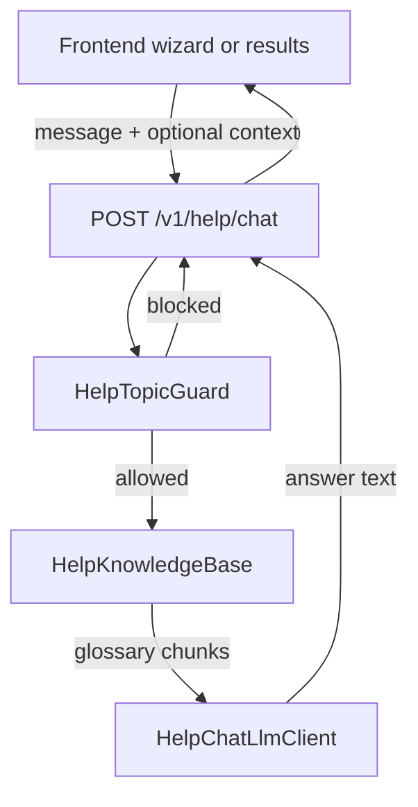

# V2 — Product Help Chat API

**Status:** Planned (V2). **Not implemented** in the current release.

This document specifies a future **help chatbot endpoint** that lets users ask questions about Plan B Validator **request fields**, **response fields**, and **how to use the product** — without exposing internal implementation (pipeline, scoring formulas, prompts, provider wiring, or codebase structure).

For the current (V1) API, see [SERVICE.md](SERVICE.md).

---

## Table of contents

1. [Problem and goals](#1-problem-and-goals)
2. [Scope](#2-scope)
3. [Architecture overview](#3-architecture-overview)
4. [API contract (proposed)](#4-api-contract-proposed)
5. [Knowledge base](#5-knowledge-base)
6. [LLM layer and prompts](#6-llm-layer-and-prompts)
7. [Safety and guardrails](#7-safety-and-guardrails)
8. [Rate limiting and cost](#8-rate-limiting-and-cost)
9. [Frontend integration](#9-frontend-integration)
10. [Configuration](#10-configuration)
11. [Implementation plan](#11-implementation-plan)
12. [Testing strategy](#12-testing-strategy)
13. [Open questions](#13-open-questions)

---

## 1. Problem and goals

### Problem

Users filling the 7-step wizard or reading an analyze report may not understand:

- What a field means (e.g. `debtObligations` vs total debt, `iWillQuitMyJob` vs side hustle)
- Valid ranges and validation rules (Likert 1–5, PDF multipart)
- How to interpret response fields (`psychologyAssessment`, `currentMarketConditionForHiring`, `scoreBreakdown`)

Today they must read [SERVICE.md](SERVICE.md) or trial-and-error. A **contextual in-app assistant** reduces friction.

### Goals (V2)

| Goal | Detail |
|------|--------|
| **Field glossary** | Explain every public request/response field in plain language |
| **Context-aware help** | Optional screen context (wizard step) or whitelisted report snapshot |
| **User-safe answers** | No leakage of pipeline, scoring math, prompts, or infrastructure |
| **Cheap and fast** | Separate from analyze; small model, short timeouts, higher rate limits than analyze |
| **Server-side only** | API keys stay on backend; frontend uses proxy like analyze |

### Non-goals (V2)

- Re-running or modifying analyze
- Personalized financial, legal, or psychological advice beyond product copy + disclaimer
- Explaining **why** a specific numeric score was computed (formulas, weights, thresholds)
- Describing internal stages (`SANITIZE`, `ScoringEngine`, Gemini/OpenAI roles, `application.yml` tuning)
- Web search or live market data in the chatbot
- Persistent user accounts or chat history stored server-side (optional client-sent history only)

---

## 2. Scope

### In scope — topics the chatbot **may** answer

| Category | Examples |
|----------|----------|
| **Request fields** | `profile.*`, `financials.*`, `planB.*`, `constraints.*`, `psychology.*`, `researchOptions.*` |
| **Response fields** | `overallVerdict`, scores, `runwayMonths`, `scoreBreakdown`, `psychologyAssessment`, `opportunityCost`, narratives, `researchContext`, `currentMarketConditionForHiring`, `dataGaps`, `disclaimer` |
| **Product usage** | JSON vs multipart analyze, resume PDF rules, rate limits on analyze, recommended client timeout (240s), no SSE |
| **Questionnaire** | How to use `GET /v1/questionnaire/questions` and map questions to psychology fields |
| **High-level scoring concepts** | “Feasibility is a 0–100 readiness score” — **without** formula or weights |

### Out of scope — topics the chatbot **must refuse**

| Category | Examples |
|----------|----------|
| **Implementation** | Pipeline order, Java classes, orchestrator, memory compact builders |
| **Scoring internals** | Weights, buckets, veto thresholds, psychology effective-months formula |
| **AI internals** | Prompt files, which provider does what, `aiProviders`, `timings` |
| **Reverse engineering** | “How do I game the score?”, “What weight does runway have?” |
| **Security / ops** | API keys, Docker, env vars beyond “keys are server-side” |

Refusal template (product tone):

> I can help with form fields and report fields, but I can’t explain how the engine calculates scores internally. Check your report’s `scoreBreakdown`, `dataGaps`, and field descriptions in the app.

---

## 3. Architecture overview



### Design principles

1. **Glossary is source of truth** — field meanings live in a curated resource, not in the model’s memory.
2. **Isolated from analyze** — do not reuse `AnalyzeOrchestrator`, `AnalysisPipelineMemory`, or narrative services; no risk of leaking compact internal payloads.
3. **Minimal context to LLM** — only retrieved glossary excerpts + optional whitelisted report fields + short conversation history.
4. **Defense in depth** — pre-filter, system prompt, post-filter, and static fallbacks for blocked topics.

### Proposed package layout (when implemented)

```
com.planbvalidator/
├── api/HelpChatController.java
├── help/
│   ├── HelpChatService.java
│   ├── HelpKnowledgeBase.java
│   ├── HelpTopicGuard.java
│   ├── HelpContextSanitizer.java
│   └── OpenAiHelpChatClient.java   # or Gemini; separate from analyze LLM services
├── domain/request/HelpChatRequest.java
├── domain/response/HelpChatResponse.java
└── resources/
    ├── help/field-glossary.json
    └── prompts/help-chat-system.txt
```

---

## 4. API contract (proposed)

### `POST /v1/help/chat`

**Purpose:** Answer user questions about product fields and usage.

**Authentication:** Same as V1 (none today); identify user for rate limiting via `X-User-Id` or IP (same pattern as analyze).

#### Request

```json
{
  "message": "What does iWillQuitMyJob mean?",
  "context": {
    "screen": "planB",
    "lastAnalyzeResponse": { }
  },
  "history": [
    { "role": "user", "content": "What is runway?" },
    { "role": "assistant", "content": "Runway is how many months..." }
  ]
}
```

| Field | Type | Required | Rules |
|-------|------|----------|-------|
| `message` | string | Yes | Max 500 chars; non-blank |
| `context.screen` | string | No | Wizard step hint: `profile`, `financials`, `planB`, `constraints`, `psychology`, `resume`, `review`, `results` |
| `context.lastAnalyzeResponse` | object | No | Whitelisted subset only (see [Context sanitization](#context-sanitization)) |
| `history` | array | No | Max 6 turns; each `role` = `user` \| `assistant`; content max 500 chars |

#### Response

```json
{
  "requestId": "uuid",
  "answer": "If unchecked, you keep your job and pursue Plan B as a side hustle...",
  "suggestedFields": ["planB.iWillQuitMyJob", "runwayMonths"],
  "refused": false
}
```

| Field | Type | Description |
|-------|------|-------------|
| `requestId` | string | Correlation ID (same as other endpoints) |
| `answer` | string | Plain-text reply for UI |
| `suggestedFields` | string[] | Optional JSON paths for UI deep-links / tooltips |
| `refused` | boolean | `true` if question was blocked or out of scope |

#### Errors

Same envelope as V1: `INVALID_INPUT` (400), `RATE_LIMITED` (429), `INTERNAL_ERROR` (500).

Optional V2 code: `HELP_UNAVAILABLE` (503) when help chat LLM is not configured — frontend can hide the widget.

---

## 5. Knowledge base

### `resources/help/field-glossary.json`

Curated, user-facing definitions derived from [SERVICE.md §3](SERVICE.md) (API reference only). **Do not** import pipeline or scoring-tuning sections.

#### Entry shape (proposed)

```json
{
  "fields": [
    {
      "path": "planB.iWillQuitMyJob",
      "direction": "request",
      "summary": "Whether you plan to quit your current job to pursue Plan B full-time.",
      "uiHint": "Unchecked = side hustle (keep job). Checked = full-time leap (quit job).",
      "validation": "Required boolean.",
      "relatedFields": ["runwayMonths", "currentMarketConditionForHiring", "scoreBreakdown.reversibility"],
      "keywords": ["quit", "side hustle", "job", "leap"]
    }
  ],
  "topics": [
    {
      "id": "multipart_analyze",
      "summary": "Upload resume as PDF part named `resume`; JSON body in part `request`.",
      "keywords": ["resume", "pdf", "upload", "multipart"]
    }
  ]
}
```

### Retrieval (V2 MVP)

1. Tokenize `message` + optional `context.screen` (boost fields for that section).
2. Score glossary entries by keyword/path overlap.
3. Return top **5–8** entries as context for the LLM (cap ~2k tokens).

### Retrieval (V2.1 optional)

Embedding search over glossary entries for paraphrased questions.

### FAQ-only fallback (optional MVP)

If LLM is disabled or retrieval confidence is high, return `summary` directly without LLM — zero hallucination risk.

---

## 6. LLM layer and prompts

### Provider

Reuse existing infrastructure pattern (`WebClient`, env API key) but **separate service class** from analyze narratives.

| Setting | Recommendation |
|---------|----------------|
| Provider | OpenAI or Gemini (configurable) |
| Model | Small/fast (e.g. `gpt-4.1-mini` or equivalent) |
| Timeout | 10–15s |
| Output | Plain text (no JSON mode required) |
| Web search | **Off** |

### System prompt (`prompts/help-chat-system.txt`) — requirements

The prompt must instruct the model to:

- Act as **Plan B Validator product help** for end users
- Use **only** provided glossary excerpts; if insufficient, say so politely
- **Never** mention: pipeline stages, Java/code, scoring weights, prompts, provider names, `aiProviders`, `timings`, orchestrator
- **Never** derive or explain numeric scores with formulas
- Include the product **disclaimer** when discussing verdicts or recommendations
- Keep answers concise (2–4 short paragraphs max)

### User message assembly

```
Glossary excerpts:
{retrieved chunks}

Optional report context (sanitized):
{whitelisted JSON}

Conversation history:
{last N turns}

User question:
{message}
```

---

## 7. Safety and guardrails

### Pre-LLM: `HelpTopicGuard`

Block or short-circuit when `message` (case-insensitive) matches internal patterns, e.g.:

- `pipeline`, `orchestrator`, `scoring engine`, `application.yml`, `weight`, `threshold`
- `prompt`, `gemini`, `openai`, `token bucket`, `bucket4j`
- `how is feasibility calculated`, `formula`, `source code`

Action: return static refusal with `refused: true` — **no LLM call**.

### Context sanitization

When `context.lastAnalyzeResponse` is present, **allowlist** only:

| Allowed | Stripped |
|---------|----------|
| `overallVerdict`, `feasibilityScore`, `riskScore`, `confidence`, `runwayMonths` | `timings`, `aiProviders`, `processingMs` |
| `scoreBreakdown`, `opportunityCost`, `psychologyAssessment` | Internal/debug keys |
| `recommendationSummary`, `majorReasons`, `redFlags`, `nextSteps` | |
| `assumptions`, `dataGaps`, `disclaimer` | |
| `researchContext`, `currentMarketConditionForHiring`, `marketValueAssessment` | |
| `resolvedProfile`, `resolvedPlanB`, `profileFieldSources` | |

### Post-LLM filter

Scan `answer` for leaked patterns (class names, stage enums, `planb.scoring`, provider names). If found, replace with generic refusal.

### Disclaimer

Append or prepend standard line when answer touches verdict/scores:

> This is decision support, not financial, legal, or psychological advice.

(Same spirit as `planb.disclaimer` in V1.)

---

## 8. Rate limiting and cost

Analyze remains heavily rate-limited (V1: 1 req / 5 min per user). Help chat should be **separate** and more permissive.

| Limit (proposed default) | Value |
|--------------------------|-------|
| Per user | 30 requests / minute |
| Global | 100 requests / minute |
| Message size | 500 chars |
| History turns | 6 max |

Implement via extended `TokenBucketRateLimiter` or a dedicated bucket in `RateLimitFilter` for `POST /v1/help/chat` only.

**Cost control:** small model, short context, refusal without LLM for blocked topics, optional daily cap per user in config.

---

## 9. Frontend integration

### Placement

| Location | `context.screen` | Behavior |
|----------|------------------|----------|
| Wizard steps 1–6 | matching step id | Field-level help, link to `suggestedFields` |
| Review step | `review` | Clarify summary rows |
| Results page | `results` | Pass whitelisted `lastAnalyzeResponse` |

### Proxy (same as V1)

| Frontend | Backend |
|----------|---------|
| `POST /api/help/chat` | `POST /v1/help/chat` |

No API keys in the browser.

### UI

- Floating help button or per-field “?” icon
- Chat panel with message list (history managed client-side)
- Show `refused` answers with neutral styling
- Hide widget if `HELP_UNAVAILABLE` or feature flag off

### Google AI Studio prompt (when building UI)

Point the frontend agent to this doc + [SERVICE.md §3](SERVICE.md) for field names. Chatbot calls proxy only; never embed glossary in frontend bundle as sole source (backend owns definitions).

---

## 10. Configuration

Proposed `application.yml` block (not present in V1):

```yaml
planb:
  help-chat:
    enabled: true
    provider: openai          # openai | gemini
    model: ${HELP_CHAT_MODEL:gpt-4.1-mini}
    timeout-ms: 12000
    max-message-chars: 500
    max-history-turns: 6
    rate-limit:
      per-user-requests-per-minute: 30
      global-requests-per-minute: 100
```

Env vars:

| Variable | Purpose |
|----------|---------|
| `HELP_CHAT_MODEL` | Override default small model |
| Reuse `OPENAI_API_KEY` / `GEMINI_API_KEY` | Same keys as V1 unless split later |

Feature flag: `planb.help-chat.enabled: false` hides endpoint or returns 503.

---

## 11. Implementation plan

Phased delivery for V2:

### Phase A — Glossary + static FAQ (no LLM)

- [ ] `field-glossary.json` covering all V1 request/response fields (including `psychologyAssessment`)
- [ ] `GET /v1/help/fields?screen=planB` — optional browse API for tooltips without chat
- [ ] Keyword retrieval + direct `summary` responses
- [ ] `HelpTopicGuard` + tests

### Phase B — LLM paraphrasing

- [ ] `POST /v1/help/chat` with retrieval + OpenAI/Gemini
- [ ] `help-chat-system.txt`
- [ ] Context sanitization for results page
- [ ] Post-LLM leak filter
- [ ] Rate limits

### Phase C — Frontend + polish

- [ ] Wizard and results chat widget
- [ ] `suggestedFields` deep-links
- [ ] Metrics/logging: `help_chat event=completed|refused|failed`

### Documentation updates (when shipped)

- Add § to [SERVICE.md](SERVICE.md) API reference
- Short note in [README.md](../README.md) under V2 features

---

## 12. Testing strategy

| Test | Purpose |
|------|---------|
| `HelpTopicGuardTest` | Blocks internal keywords; allows field questions |
| `HelpKnowledgeBaseTest` | Retrieval returns correct entries for sample queries |
| `HelpContextSanitizerTest` | Strips `timings`, `aiProviders` from context |
| `HelpChatServiceTest` | Mock LLM; verifies prompt contains glossary only |
| `HelpChatControllerIT` | 400 on empty message, 429 when rate limited |
| Golden-file answers | Optional: snapshot safe answers for top 20 FAQ questions (LLM off) |

Manual QA checklist:

- “What is `debtObligations`?” → EMI explanation, no pipeline mention
- “How is feasibility calculated?” → refusal, points to `scoreBreakdown`
- “What does my risk profile mean?” with results context → uses `psychologyAssessment` glossary only

---

## 13. Open questions

| # | Question | Options |
|---|----------|---------|
| 1 | Store server-side chat history? | **Default: no** (client sends history); revisit if abuse patterns appear |
| 2 | Separate API key for help chat? | Reuse V1 keys initially; split for cost accounting later |
| 3 | Gemini vs OpenAI for help | Configurable; default cheapest OpenAI mini |
| 4 | Localized answers (Hindi, etc.)? | V2 English only; i18n glossary in V2.1 |
| 5 | `GET /v1/help/fields` without chat? | Recommended for tooltips without LLM cost |

---

## Related documents

| Document | Relationship |
|----------|--------------|
| [SERVICE.md](SERVICE.md) | V1 canonical API — glossary must stay in sync with §3 |
| [README.md](../README.md) | Entry point; link to this doc when V2 ships |

---

*V2 feature specification — help chat API. Not implemented in current release.*
